

<a href="https://wakatime.com/@DverkaSK"><picture><source media="(prefers-color-scheme: dark)" srcset="cards/languages-dark.svg" />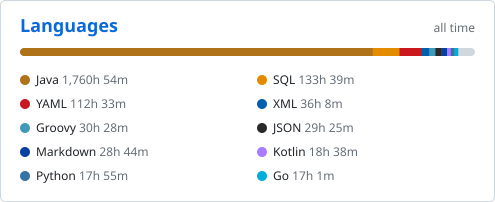</picture></a>

<a href="https://wakatime.com/@DverkaSK"><picture><source media="(prefers-color-scheme: dark)" srcset="cards/editors-dark.svg" />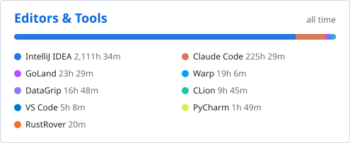</picture></a>

<a href="https://wakatime.com/@DverkaSK"><picture><source media="(prefers-color-scheme: dark)" srcset="cards/ai-coding-dark.svg" />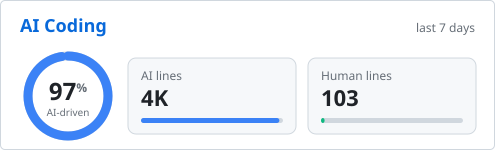</picture></a>

<a href="https://wakatime.com/@DverkaSK"><picture><source media="(prefers-color-scheme: dark)" srcset="cards/ai-models-dark.svg" />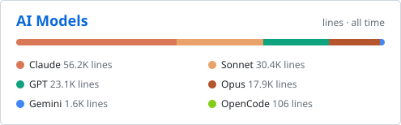</picture></a>

<a href="https://wakatime.com/@DverkaSK"><picture><source media="(prefers-color-scheme: dark)" srcset="cards/apps-dark.svg" />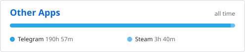</picture></a>

[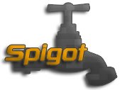](https://www.spigotmc.org/members/dverkask.1954357/) [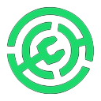](https://modrinth.com/user/DverkaSK)

🇬🇧 English

<h3 align="LEFT">🛠️ My Stack before 2026</h3>

&nbsp;&nbsp;&nbsp;&nbsp;<picture><source media="(prefers-color-scheme: dark)" srcset="icons/gradle-white.svg" /></picture>&nbsp;&nbsp;&nbsp;&nbsp;&nbsp;&nbsp;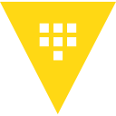&nbsp;&nbsp;&nbsp;&nbsp;&nbsp;&nbsp;&nbsp;&nbsp;&nbsp;&nbsp;<picture><source media="(prefers-color-scheme: dark)" srcset="icons/kafka-white.svg" />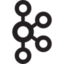</picture>&nbsp;&nbsp;&nbsp;&nbsp;&nbsp;&nbsp;&nbsp;&nbsp;&nbsp;&nbsp;&nbsp;&nbsp;&nbsp;&nbsp;&nbsp;&nbsp;&nbsp;&nbsp;&nbsp;&nbsp;&nbsp;&nbsp;&nbsp;&nbsp;

<h3 align="LEFT">🤖 My Stack after 2026</h3>

<picture><source media="(prefers-color-scheme: dark)" srcset="icons/openai-white.svg" />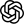</picture>&nbsp;&nbsp;&nbsp;&nbsp;&nbsp;&nbsp;&nbsp;&nbsp;<picture><source media="(prefers-color-scheme: dark)" srcset="icons/grok-white.svg" />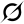</picture>&nbsp;&nbsp;&nbsp;&nbsp;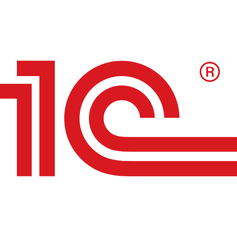

🇷🇺 Русский

<h3 align="LEFT">🛠️ Мой стек до 2026 года</h3>

&nbsp;&nbsp;&nbsp;&nbsp;<picture><source media="(prefers-color-scheme: dark)" srcset="icons/gradle-white.svg" /></picture>&nbsp;&nbsp;&nbsp;&nbsp;&nbsp;&nbsp;&nbsp;&nbsp;&nbsp;&nbsp;&nbsp;&nbsp;&nbsp;&nbsp;&nbsp;&nbsp;<picture><source media="(prefers-color-scheme: dark)" srcset="icons/kafka-white.svg" /></picture>&nbsp;&nbsp;&nbsp;&nbsp;&nbsp;&nbsp;&nbsp;&nbsp;&nbsp;&nbsp;&nbsp;&nbsp;&nbsp;&nbsp;&nbsp;&nbsp;&nbsp;&nbsp;&nbsp;&nbsp;&nbsp;&nbsp;&nbsp;&nbsp;

<h3 align="LEFT">🤖 Мой стек после 2026 года</h3>

<picture><source media="(prefers-color-scheme: dark)" srcset="icons/openai-white.svg" /></picture>&nbsp;&nbsp;&nbsp;&nbsp;&nbsp;&nbsp;&nbsp;&nbsp;<picture><source media="(prefers-color-scheme: dark)" srcset="icons/grok-white.svg" /></picture>&nbsp;&nbsp;&nbsp;&nbsp;

