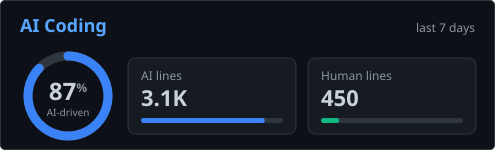

 

🇬🇧 English

<h3 align="LEFT">🛠️ My Stack before 2026</h3>

&nbsp;&nbsp;&nbsp;&nbsp;<picture><source media="(prefers-color-scheme: dark)" srcset="icons/gradle-white.svg" /></picture>&nbsp;&nbsp;&nbsp;&nbsp;&nbsp;&nbsp;&nbsp;&nbsp;&nbsp;&nbsp;&nbsp;&nbsp;&nbsp;&nbsp;&nbsp;&nbsp;<picture><source media="(prefers-color-scheme: dark)" srcset="icons/kafka-white.svg" /></picture>&nbsp;&nbsp;&nbsp;&nbsp;&nbsp;&nbsp;&nbsp;&nbsp;&nbsp;&nbsp;&nbsp;&nbsp;&nbsp;&nbsp;&nbsp;&nbsp;&nbsp;&nbsp;&nbsp;&nbsp;&nbsp;&nbsp;&nbsp;&nbsp;

<h3 align="LEFT">🤖 My Stack after 2026</h3>

<picture><source media="(prefers-color-scheme: dark)" srcset="icons/openai-white.svg" /></picture>&nbsp;&nbsp;&nbsp;&nbsp;&nbsp;&nbsp;&nbsp;&nbsp;<picture><source media="(prefers-color-scheme: dark)" srcset="icons/grok-white.svg" /></picture>&nbsp;&nbsp;

🇷🇺 Русский

<h3 align="LEFT">🛠️ Мой стек до 2026 года</h3>

&nbsp;&nbsp;&nbsp;&nbsp;<picture><source media="(prefers-color-scheme: dark)" srcset="icons/gradle-white.svg" /></picture>&nbsp;&nbsp;&nbsp;&nbsp;&nbsp;&nbsp;&nbsp;&nbsp;&nbsp;&nbsp;&nbsp;&nbsp;&nbsp;&nbsp;&nbsp;&nbsp;<picture><source media="(prefers-color-scheme: dark)" srcset="icons/kafka-white.svg" /></picture>&nbsp;&nbsp;&nbsp;&nbsp;&nbsp;&nbsp;&nbsp;&nbsp;&nbsp;&nbsp;&nbsp;&nbsp;&nbsp;&nbsp;&nbsp;&nbsp;&nbsp;&nbsp;&nbsp;&nbsp;&nbsp;&nbsp;&nbsp;&nbsp;

<h3 align="LEFT">🤖 Мой стек после 2026 года</h3>

<picture><source media="(prefers-color-scheme: dark)" srcset="icons/openai-white.svg" /></picture>&nbsp;&nbsp;&nbsp;&nbsp;&nbsp;&nbsp;&nbsp;&nbsp;<picture><source media="(prefers-color-scheme: dark)" srcset="icons/grok-white.svg" /></picture>&nbsp;&nbsp;

