

<a href="https://wakatime.com/@DverkaSK"><picture><source media="(prefers-color-scheme: dark)" srcset="cards/languages-dark.svg" />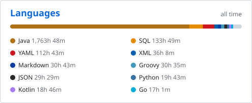</picture></a>

<a href="https://wakatime.com/@DverkaSK"><picture><source media="(prefers-color-scheme: dark)" srcset="cards/editors-dark.svg" /></picture></a>

<a href="https://wakatime.com/@DverkaSK"><picture><source media="(prefers-color-scheme: dark)" srcset="cards/ai-coding-dark.svg" /></picture></a>

<a href="https://wakatime.com/@DverkaSK"><picture><source media="(prefers-color-scheme: dark)" srcset="cards/ai-models-dark.svg" /></picture></a>

<a href="https://wakatime.com/@DverkaSK"><picture><source media="(prefers-color-scheme: dark)" srcset="cards/apps-dark.svg" />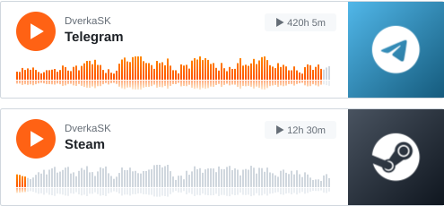</picture></a>

 [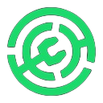](https://modrinth.com/user/DverkaSK)

<h3 align="center">🛠️ My Stack before 2026</h3>

  &nbsp;&nbsp;
  &nbsp;&nbsp;
  &nbsp;&nbsp;
  &nbsp;&nbsp;
  

  &nbsp;&nbsp;
  &nbsp;&nbsp;
  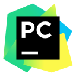&nbsp;&nbsp;
  &nbsp;&nbsp;
  &nbsp;&nbsp;
  &nbsp;&nbsp;
  &nbsp;&nbsp;
  <picture><source media="(prefers-color-scheme: dark)" srcset="icons/bash-white.svg" /></picture>

  &nbsp;&nbsp;
  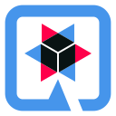&nbsp;&nbsp;
  &nbsp;&nbsp;
  <picture><source media="(prefers-color-scheme: dark)" srcset="icons/gradle-white.svg" /></picture>&nbsp;&nbsp;
  &nbsp;&nbsp;
  &nbsp;&nbsp;
  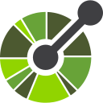&nbsp;&nbsp;
  &nbsp;&nbsp;
  &nbsp;&nbsp;
  

  &nbsp;&nbsp;
  &nbsp;&nbsp;
  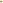&nbsp;&nbsp;
  &nbsp;&nbsp;
  &nbsp;&nbsp;
  &nbsp;&nbsp;
  &nbsp;&nbsp;
  <picture><source media="(prefers-color-scheme: dark)" srcset="icons/kafka-white.svg" />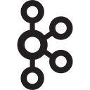</picture>&nbsp;&nbsp;
  &nbsp;&nbsp;
  &nbsp;&nbsp;
  

  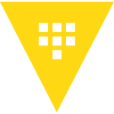&nbsp;&nbsp;
  &nbsp;&nbsp;
  &nbsp;&nbsp;
  &nbsp;&nbsp;
  &nbsp;&nbsp;
  &nbsp;&nbsp;
  &nbsp;&nbsp;
  &nbsp;&nbsp;
  &nbsp;&nbsp;
  

  &nbsp;&nbsp;
  &nbsp;&nbsp;
  &nbsp;&nbsp;
  &nbsp;&nbsp;
  &nbsp;&nbsp;
  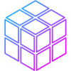&nbsp;&nbsp;
  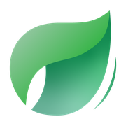&nbsp;&nbsp;
  

  &nbsp;&nbsp;
  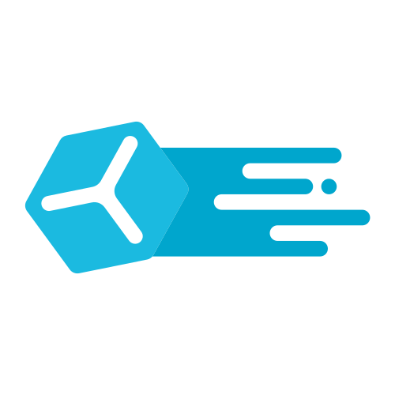&nbsp;&nbsp;
  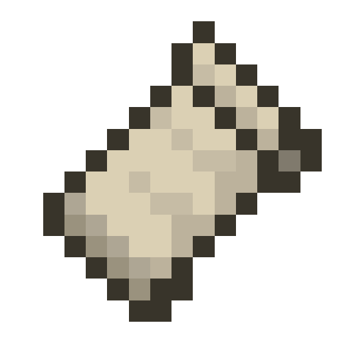&nbsp;&nbsp;
  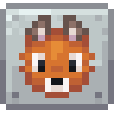&nbsp;&nbsp;
  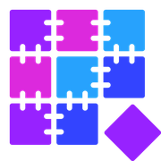

<h3 align="center">🤖 My Stack after 2026</h3>

  &nbsp;&nbsp;
  <picture><source media="(prefers-color-scheme: dark)" srcset="icons/openai-white.svg" /></picture>&nbsp;&nbsp;
  

  &nbsp;&nbsp;
  <picture><source media="(prefers-color-scheme: dark)" srcset="icons/grok-white.svg" /></picture>&nbsp;&nbsp;
  &nbsp;&nbsp;
  <picture><source media="(prefers-color-scheme: dark)" srcset="icons/kimi-white.svg" /></picture>

  <picture><source media="(prefers-color-scheme: dark)" srcset="icons/ollama-white.svg" /></picture>&nbsp;&nbsp;
  <picture><source media="(prefers-color-scheme: dark)" srcset="icons/langchain-white.svg" /></picture>&nbsp;&nbsp;
  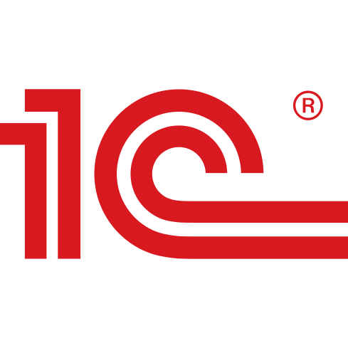

<!--

Стартер пак

**Tampermonkey:** [сайт](https://www.tampermonkey.net/) / [Chrome](https://chromewebstore.google.com/detail/tampermonkey/dhdgffkkebhmkfjojejmpbldmpobfkfo) / [Firefox](https://addons.mozilla.org/firefox/addon/tampermonkey/) 
**Violentmonkey:** [сайт](https://violentmonkey.github.io/) / [Chrome](https://chromewebstore.google.com/detail/violentmonkey/jinjaccalgkegednnccohejagnlnfdag) / [Firefox](https://addons.mozilla.org/firefox/addon/violentmonkey/)

- **YouTube Menu Downloader**: [установить](https://raw.githubusercontent.com/DverkaSK/youtube-menu-downloader/main/youtube-menu-downloader.user.js) / [GitHub](https://github.com/DverkaSK/youtube-menu-downloader)
- **Telegram View Once**: [установить](https://raw.githubusercontent.com/DverkaSK/tg-view-once/main/tg-view-once.user.js) / [GitHub](https://github.com/DverkaSK/tg-view-once)
- **VK Video Downloader**: [установить](https://raw.githubusercontent.com/DverkaSK/VK-Video-Downloader/main/monkeys/scripts/VK-Video-Downloader-desktop.user.js) / [мобильная](https://raw.githubusercontent.com/DverkaSK/VK-Video-Downloader/main/monkeys/scripts/VK-Video-Downloader-mobile.user.js) / [GitHub](https://github.com/DverkaSK/VK-Video-Downloader)

**Все скрипты одним архивом:** [userscripts.zip](https://github.com/DverkaSK/DverkaSK/releases/download/userscripts/userscripts.zip)

**Программы**

- **Yandex Music Liberty**: [скачать](https://github.com/gagayhhad-tech/YandexMusicLiberty/releases/latest) / [GitHub](https://github.com/gagayhhad-tech/YandexMusicLiberty)
- **TG WS Proxy**: [Windows](https://github.com/Flowseal/tg-ws-proxy/releases/latest/download/TgWsProxy_windows.exe) / [Android](https://github.com/amurcanov/tg-ws-proxy-android/releases/latest) / [GitHub](https://github.com/Flowseal/tg-ws-proxy) / [GitHub Android](https://github.com/amurcanov/tg-ws-proxy-android)
- **Win11Debloat**: [скачать](https://github.com/Raphire/Win11Debloat/releases/latest/download/Get.ps1) / [GitHub](https://github.com/Raphire/Win11Debloat)
- **VibeVM**: [скачать](https://github.com/vibevm/vibevm/releases/latest/download/install.cmd) / [GitHub](https://github.com/vibevm/vibevm)

-->
